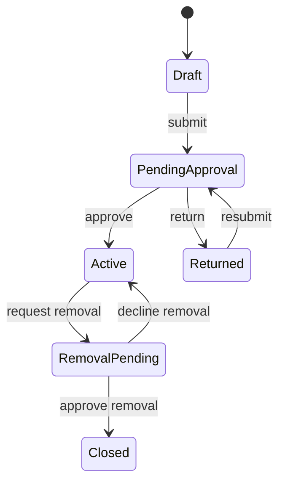

# MYCWLNext product specification

## Purpose

MYCWLNext gives credit teams one controlled place to identify deteriorating
borrowers, record the rationale for watchlisting, assign remediation actions,
perform periodic reviews, and evidence independent approval.

This is a learning application, not a production credit decision system.

## Personas

| Division | Case owner | Approver |
| --- | --- | --- |
| PNC | PNC Case Owner | PNC Approver |
| GWMA | GWMA Case Owner | GWMA Approver |
| GWMSI | GWMSI Case Owner | GWMSI Approver |
| IB | IB Case Owner | IB Approver |

The administrator can view every division, maintain reference data, reassign
work, and inspect the audit log. Administrators do not replace the division
approver in maker-checker decisions.

## Case lifecycle

## Monthly review lifecycle

Each active case receives one review for every calendar month. The case owner
updates financial observations, risk indicators, action progress, current risk
rating, recommendation, and commentary. The division approver approves or
returns it. Overdue status is derived from the due date.

## Core business rules

1. Case owners can create and edit cases only for their division.
2. A case owner cannot approve their own submission.
3. Approvers can decide submissions only for their division.
4. Material risk fields require a rationale and become audit events.
5. Active cases must have a next review date and at least one open action.
6. Watchlist removal requires evidence, a recommendation, and approval.
7. Every transition stores actor, timestamp, previous state, and new state.
8. Administrators have cross-division visibility but cannot silently alter
   completed approvals.

## Suggested refactoring exercises

- Extract the frontend demo store into API query/mutation hooks.
- Replace string unions with generated OpenAPI client types.
- Introduce a workflow/state-machine module.
- Separate read models from write models.
- Add event-driven review generation.
- Replace seeded identities with OIDC authentication and policy checks.

